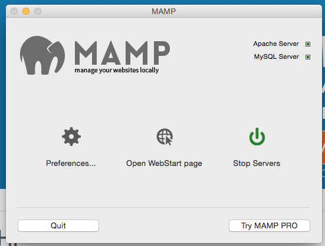
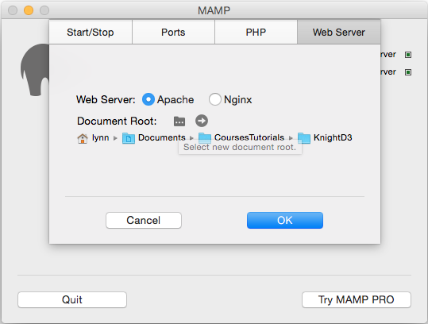

### d3-faq
# FAQs and Frequently Encountered Problems (FEPs) When Learning D3

**_With contributions from Scott Murray, Sophie Engle, Lynn Cherny_**

TOC:

* [Loading Data, CSVs, JSON, etc.](#loading-data)
* [General D3](#general-d3)
* [General Gotchas and FAQs with JS](#gotchas-js)
* [Debugging Help](#debugging-help)
* [Tool Setup and Use](#tool-setup)
* [Useful Code Snippets](#useful-code-snippets)


<a name="loading-data"></a>Loading Data, CSVs, JSON, etc.
=========================================================

There is great material on loading your data, with nice explanations, in [Learn JS Data](http://learnjsdata.com/read_data.html).


**CSV Column Headers: Avoid spaces! Keep them Short!**

It's safest not to use spaces in your header column names, and try to keep them short so you can work with them (but still know what they refer to).  So, a column called “Years of Drought” should be named to something like “DroughtYears" or "drought_years".

Your source data may have very long column headers, but you don't want to be typing them in (and having to use quotes because of spaces) in your code.  Abbreviate!

From Scott Murray:

    I strongly recommend simplifying column titles so they do not include spaces. Why? JavaScript object notation is simpler without spaces. Let me give you an example.

    Say you define an object like so:

    var object = { 
      Country: “USA”,
      “Number of Bananas per Capita (millions)”: “556”,
      ”Total Length of Peels if Laid End to End (kilometers)”: “412415123”
    }

    To get at the value “556”, you would need to type:

    object[“Number of Bananas per Capita (millions)”]

    However, if you excluded spaces from your column titles, so your object looked like this:

    var object = { 
      country: “USA”,
      numBananas: “556”,
      peelLength: “412415123”
    }

    …well first of all, that is so much easier to read, but also then you can use simplified object notation:

    object.numBananas  //returns “556”

    See, you don’t need the quotation marks or the brackets. So eliminating spaces just saves you a lot of typing and headache later.


**Number format in CSV/data files**

Remove commas in numeric values - replace a value of “3,050” with “3050.”  Javascript knows it’s thousands!  Change the number format or type of the cell before saving a spreadsheet as csv, to be sure you fix this.

Beware international number formats with periods as separators for thousands and commas for decimals (e.g., 234.567,89).  JS expects no comma in the thousands position, and decimal for a float.

**Right separator? (CSV--"comma separated values" or TSV--"tab" etc.)**

Beware of the separator character and make sure it’s comma if you’re using d3.csv, or tab if you want tab separated and d3.tsv (See [Mike's example](https://gist.github.com/mbostock/3305937)).  Check your data file and fix!


**Numbers are Read as Strings-Convert Them!**

Data values read in with d3.csv will be read as strings.  You need to convert types to use numeric values.

Convert input data types from string to numeric for use in functions:

- `+x` is a “shorthand” for “treat x as a number”.
- use `parseFloat(x)` or `parseInt(x)` otherwise, or
- `Number(x)`

**Wide vs. long format for data - how do I transform it?**

The difference: https://en.wikipedia.org/wiki/Wide_and_narrow_data

In D3's csv read, each row becomes an object with those attributes, hence often wide format is used for the data. If you have long or narrow format, you can use nest to group by some object identified.

E.g.: http://stackoverflow.com/questions/15533533/multiline-chart-in-d3-with-long-format-data

In Python (especially with pandas), R (melt or reshape), and Excel (with VBA or by hand), you can transform data prior to import.

There is some information on reformatting data by nesting, etc., at http://learnjsdata.com/group_data.html.

TODO: ADD MORE.


**Using multiple data files (elegantly) - queue, asynchrony, etc.**

TODO

**How do I treat data sources with a [-, NaN, NA, null] for 0?**

TODO


####JSON File Format

**Be aware and beware of invalid JSON:**

JSON format looks like this (from [Wikipedia](http://en.wikipedia.org/wiki/JSON)):

````
{
  "firstName": "John",
  "lastName": "Smith",
  "isAlive": true,
  "age": 25,
  "address": {
    "streetAddress": "21 2nd Street",
    "city": "New York",
    "state": "NY",
    "postalCode": "10021-3100"
  },
  "phoneNumbers": [
    {
      "type": "home",
      "number": "212 555-1234"
    },
    {
      "type": "office",
      "number": "646 555-4567"
    }
  ],
  "children": [],
  "spouse": null
}
````

Notice, the labels are in double quotes.  You can check your data’s format in a validator online: http://jsonformat.com/.


<a name="general-d3"></a>General D3 Intro Questions
===================================================

####What is or what does it mean to say '+d.someProperty'?**

A shorthand often seen in Mike Bostock's code (and now everyone else's) to cast a d.value as a number. Sometimes improper use of this causes errors.

####How do I add a tooltip?

The poor and fast way is to use the `title` attribute on an appropriate SVG object. This requires the user to hover over the item for a bit before it appears.  Not the most recommended or most flexible.

Here's a nice lib:

* http://darkmarmot.github.io/kodama/?utm_content=buffer3ff40

Otherwise some people use tipsy:

* http://bl.ocks.org/ilyabo/1373263

Or here's a simple reusable lib called d3-tip:

* https://github.com/Caged/d3-tip

Or roll your own with html/css.  Here's an example: https://bl.ocks.org/arnicas/c911d0abfe9819305660


####How do I add a legend?

Seriously, use this by Susie Lu:

* https://github.com/susielu/d3-legend
* Code example: http://bl.ocks.org/curran/950cbe78b4c307fa14a1
* Docs for it: http://d3-legend.susielu.com/


####Style vs. Attr for SVG elements

Use style sheets when you can, because you want to keep the formatting independent of the code as much as possible.  This makes it easier to swap in a new look without having to hunt through code for the right variables and when they are applied.  This means instead of doing hard-coded

````
    d3.select(‘rect’).style(‘fill’, ‘red’)
````
it’s better to add a class or id and put the style attribute there:
````
    d3.select(‘rect’).attr(‘class’, ‘redrect’)
````
and then in the style sheet:
````
    .redrect { fill: red }
````

For dynamic styling, you want to do it inline, of course. From [an excellent article on best practices in D3 coding](https://northlandia.wordpress.com/2014/10/23/ten-best-practices-for-coding-with-d3/):

````
.style("fill", function(d) {
        return choropleth(d, colorize);
    })

//OVERRIDES

    .attr("fill", function(d) {
        return choropleth(d, colorize);
    })

````

    "Things can get confusing if you assign a style rule as a style in one place and then try to re-assign it as an attribute in another. Thus, it’s best to pick one or the other, and style generally seems more appropriate to me. Note that this does not apply to element x/y positions or path d strings, which are only available as attributes." [Source: [an excellent article on best practices in D3 coding](https://northlandia.wordpress.com/2014/10/23/ten-best-practices-for-coding-with-d3/)]


####Date Formats and Formatting - Reading and Writing!

A date must be “parse”d to read it in, not just declared in the format string. Example:
TODO

####Loading Multiple Files

* Understanding the pros/cons of loading files asynchronously, chaining `d3.json()` calls to load files synchronously, and using [`Queue.js`](https://github.com/mbostock/queue) instead.

####Efficiency

Save your `d3.selectAll()` selections if you plan to reuse them (just be wary if the selection changes).

**Okay:**

```
var bubbles = d3.selectAll("circle");
bubbles.attr("cx", 5);
bubbles.attr("cy", 10);
```

*or*

```
d3.selectAll("circle")
  .attr("cx", 5)
  .attr("cy", 10);
```

**Less Efficient:**

```
d3.selectAll("circle").attr("cx", 5);
d3.selectAll("circle").attr("cy", 5);
```

####Formatting and Working with SVG Text

Text in SVG is a pain.  There are common issues and solutions.

**How do I split long lines of SVG text?**

TODO

**How do I add an icon or html to SVG text?**

TODO

####Data() vs. Datum()**

Which to use when?

TODO

####Understanding the difference between chaining and/or naming transitions, versus not.

TODO

####How to put multiple graphs on the page (small multiples)

TODO

####Method chaining and the reusable chart pattern

TODO


<a name="gotchas-js"></a>General Gotchas and FAQs with JS
=========================================================

This site has some nice docs on weird bits of JS: http://bonsaiden.github.io/JavaScript-Garden/

**Case Sensitivity--Or, lower and upper case letters matter!**

JS is case-sensitive.  You can’t call your variable **d.affluence** if the value is really **d.Affluence**.  Also, **d.yearlyAvg** is not the same as **d.yearlyavg**.  If you read them in from a CSV file, check your header labels!

**Invalid Characters in Variable Names**

To be safe, you should follow these rules: variable names should start with a letter or `_` or `$` and the other characters can be letters or `_` or `$` or numbers.  You may not start a variable name with a number. You may not use `-` in your variable name. You can't use spaces in variable names. Some people like to use camelcase in longer variable names, because it avoids spaces and allows you to parse words visually:  camelCase. lowerCaseThenUpperCase.

**Using a CDN for included libraries**

A CDN is a repository for code online (**content delivery network**).  For non-local development, or for bl.ocks.org display, you need paths to CDNs for d3 and tools like jquery, or your bl.ocks won't display correctly.

* D3: https://cdnjs.cloudflare.com/ajax/libs/d3/3.5.6/d3.js
* JQuery: https://code.jquery.com/jquery-2.1.4.js, or minified: https://code.jquery.com/jquery-2.1.4.min.js (see their links: https://code.jquery.com/)


**How do I round numbers?**

For integer rounding: `Math.round(num)`.

For 2-place decimal rounding, use ` num.toFixed(2) `.

Don't forget to make `num` a real number first if it came in as a string: `parseFloat("123.456").toFixed(2)`.  If you want to use the '+' shorthand to make it a number, you will need brackets: `(+"45.534").toFixed(2)`.


**Missing or improperly placed } or })**

TODO

**Missing semicolons confusing interpretation of JavaScript**

TODO

**var scope**

* Initially, variables in included script files are the same as variables defined in the HTML body script sections.
* global and local

**What is `this`?**

TODO

**Equivalence and "Equivalence" in JS**

TODO:
Understanding the "equivalent-ish" operator `==` versus the "equivalent" operator `===` and when one is beneficial and when it is not. Especially since `if(something)` is often used in examples to detect if something is not undefined, but will break if your data has 0 values in it.

**Script file at start in head or at end.**
TODO


<a name="debugging-help"></a>Debugging Help
===========================================


Check out the Chrome [tips and tricks](https://developer.chrome.com/devtools/docs/tips-and-tricks) for using the console for debugging.

*Video on console use for D3: https://egghead.io/lessons/debugging-with-dev-tools

*Parts of the dev tools in chrome: http://www.html5rocks.com/en/tutorials/developertools/part1/


_TODO: How to debug in the console - console.log, breakpoints, inspect elements, d3 at the command line._


###Debugging NaNs: Where is that NaN coming from?

**NaN and other problems from a d3 scale:**

Is your scale set for the expected domain and range?  You need to give them arrays, which means values in square brackets, or use d3.extent to get an array of the lowest and highest values for you:

````
var yearScale = d3.time.scale()
    .domain(d3.extent(data, function (d) { return d.year;}))
    .range([50, window.innerWidth - 50]);
````

You use the scale by calling it as a function on a value, which will be mapped from the domain to the range:

````
return yearScale(d.year);

````

Remember that if you assign a function to a variable, it's still a function! Some D3 methods are returning *function* objects, for example with `var x = d3.scale.linear();` the variable `x` is now a function that was created by `d3.scale.linear()`.

**NaN after reading in a data file**

Did you parse the value correctly?  Is there a value in the cell?

**Coping with NaNs when charting (bars, lines)**

TODO


**More Debugging Tips**:

Check the size of your selections first. For example:

    ```console.log(d3.select("#plot").selectAll("circle").size());```

Then, worry about whether the problem is in the rest of the chain.

Check the values of your functions using accessors. For example, don't tell me you set the domain and range properly, show me you set it properly:

    ```console.log(x.domain(), x.range());```

Test what your functions return! You can give them sample input:

    ```console.log(x(5));```


<a name="tool-setup"></a>Tool Setup and Use
===========================================

###Running a Server

You won't be able to use d3 or other javascript files without a web server running on your machine. Plain html and CSS will display fine, but anything computational needs to be done with a server to 'view' your pages.

On Windows, WAMP is a full-service free server (plus MySQL if you want it in the future.) On Mac, you can use either MAMP or run a server in your directory using Python or node from the command line.  Or use an editor that does live previews, like Brackets, but we really recommend learning how to run a server.

####Wamp on Windows

For a windows server, look here: http://www.wampserver.com/en/
There is some guidance in [this slideshow on configuring WAMP](http://www.slideshare.net/triniwiz/wamp-20949805) - I recommend you don't set Firefox as your default browser, but Chrome instead.

Your default `www` files directory will be inside the wamp folder on your computer. You want to move your files into that directory to be able to view them. By default, the index.php file will display when you open `http://localhost` in a browser. To see the files you want, you will need to add the directory path to that url: `http://localhost/my_folder/`.  Then any index.html in that directory will display instead, if you're configured right. Or hopefully a list of files, if there's no index.html!

####MAMP Setup on Macs

The location for MAMP is here: https://www.mamp.info/en/downloads/.  You only need MAMP, not MAMP Pro, unless you want to get extra nice features for money.

If you are struggling with the setup for the web server on a Mac:  After downloading MAMP, double click to install and go through the install screens.  Then find the app icon for MAMP (not MAMP Pro! that's a free trial) in your Launchpad or Applications directory and start it up.

You will see a preferences icon on the left:



 Apparently MAMP by default uses a port that is used by other stuff like Skype (8888).  You will probably want to change it.  If your server never starts (the button never turns green on the dialog), you probably have a port conflict. If you click on the **Preferences**, you can change the port for the localhost server if you want.  (I wanted a different one because I have other servers running on the same machine.  The default port for web servers is 80, but it may be in use already.)  If you change the port, for example to 7777, you will enter the url in your browser as:

```http://localhost:7777```

to see your files list.

To get those files --- You may want to click on the Preferences and **set a new home directory** for your server.  Click on the "Web Server" tab and double click on the document root icon to pick a new directory.  I made one called **Knight D3** for this example.



Put the files you want to view in the browser into the directory you set as your Document Root. Make sure the server is running - on the Start/Stop tab there should be a green server power icon showing.

Then, in your browser, go to `http://localhost` or `http://localhost:<YourNumber>` and you should see the files with links if they are HTML files.

If you run into an error on Yosemite 10, try this fix: http://stackoverflow.com/questions/25333173/mysql-with-mamp-does-not-work-with-osx-yosemite-10-10/26446158#26446158.

###Python SimpleServer from Command Line

Alternately, from a Terminal program command line on the Mac (google how to find and start one), you can start a web server in the directory with your files:

````
>python -m HTTPSimpleServer 5555
````

You'll need to run this whenever you want to work on your web files.  You'll go to `http://localhost:5555` to see the files in the directory if you use the command above.

You can stop the webserver by typing ^c (control-c) in that window.

###Node Server

On a Mac, if you have Homebrew, use Homebrew to install Node, and then install http-server. Run it in the directory of your files, with & so you can get your command line back.

````
brew install node
npm install -g http-server
http-server
````
This will make your server at `http://localhost:8080`.


####Brackets Editor Preview Option

Apparently the Brackets MACOSX editor will run like a server and display your files just fine locally: http://brackets.io/.  (I don't have any details about how this works yet.)

------------

###GitHub

Intros to GitHub:

 * https://guides.github.com/activities/hello-world/
 * http://blog.teamtreehouse.com/git-for-designers-part-1
 * http://vallandingham.me/Quick_Git.html

Command line is an issue on Windows:
* [Command Line github on Windows](http://stackoverflow.com/questions/11000869/command-line-git-on-windows)


###Bl.ocks.org and Gists

You might want to look at Mike's Command line tutorial on making a block: http://bost.ocks.org/mike/block/

**Seeing source gist for a bl.ock:**

To find the source of a bl.ocks.org link, just replace the blocks part with gist.github.com:

```
http://bl.ocks.org/AndresClavijo/9706481d505f2553a71a
becomes
https://gist.github.com/AndresClavijo/9706481d505f2553a71a
```

Or add the extension to your browser (however, this isn't working for me right now): https://github.com/mbostock/bl.ocks.org (scroll down)

Note that the bl.ocks.org site takes a few mins to catch up to changes on the gists site.

**Seeing a Gist as a Bl.ock**:

  **VERY IMPORTANT: Your block view of a gist will only display visually if you have an index.html file in the gist!**


**Path to d3 in a bl.ocks.org file:**

Your d3 won’t display in the live page in a published gist/bl.ock if you don’t use the path to the online CDN (rather than your local version).  Your error in your console will say “d3 cannot be found.”

````
    <script type="text/javascript" src="http://d3js.org/d3.v3.js"></script>
````

**How do I get an image in bl.ocks.org previews?**

Using git and adding a thumbnail: http://bost.ocks.org/mike/block/#advanced

**Command line gistup tool: https://github.com/mbostock/gistup**

TODO: Say more?

### (Shell) Command Line

Knowing something about command line usage (Unix/bash/etc) is a good idea. A nice intro tutorial: http://cli.learncodethehardway.org/book/


<a name="useful-code-snippets"></a>Useful Code Snippets
=======================================================

I recommend you use/look into lowdash: http://colintoh.com/blog/lodash-10-javascript-utility-functions-stop-rewriting

These code snippets are in the js directory:


* **fixBounds.js**: fixes the size and viewbox of an SVG
to fit an inner group with the specified padding. Both the
svg and group parameters need to be D3 selections.

* **processError.js**: for handling error during file read.

* **translate.js**: helper for translating SVG elements.

* **moveToFront.js**: helper to move the currently selected item to top (in crowded plots)


<a name="resources"></a>Resources
=================================

### Learning JS for free, online

See https://www.javascript.com/resources.

